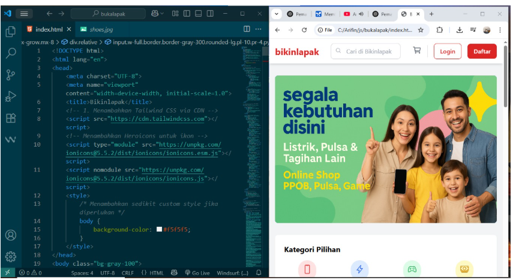

# Cypress-API Testing Project


📁 This is an end-to-end testing project using Cypress, covering UI simulation, API testing, and data-driven form testing.

## 📦 Project Structure

CYPRESS-API/
├── cypress/
│ ├── e2e/
│ │ ├── api-reqres.cy.js # CRUD testing using Reqres dummy API
│ │ ├── api-simulation.cy.js # Local API simulation tests
│ │ ├── bukalapak-clone-test.cy.js # E2E UI test for Bukalapak clone
│ │ ├── crud-simulation.cy.js # Combined UI and API CRUD simulation
│ │ ├── crud-ui-simulation.cy.js # CRUD via HTML form
│ │ ├── data-driven-form.cy.js # Form test using fixture JSON
│ │ └── spec.cy.js # Default Cypress example test
│ ├── fixtures/ # JSON files for test data
│ ├── support/ # Custom commands and setup support
├── images/ # Screenshots or test results (optional)
├── bukalapak-clone.html # Sample UI form for Bukalapak simulation (Replika)
├── employee-form.html # Employee form for CRUD testing
├── index.html # Basic form HTML for UI tests
├── cypress.config.js # Cypress configuration file
├── package.json # Project dependencies
├── package-lock.json # Dependency lock file


---

## 🚀 Getting Started

### 1. Install dependencies
```bash
npm install
2. Serve HTML locally
bash
Copy
Edit
npx serve .
Access via http://127.0.0.1:3000/employee-form.html or any file in the root directory.

3. Launch Cypress
bash
Copy
Edit
npx cypress open
✅ Test Features
✔️ Form Validation (UI)

✔️ CRUD API using Reqres

✔️ Data Driven Testing with JSON

✔️ Simple Frontend Simulations

✔️ Marketplace Replica UI Test

📌 Notes
.html files are used for local UI simulations and testing without backend

Use a local server like serve to test forms via Cypress

✍️ Author
Muhammad Arifin Nursalim, S.Kom – IT Trainer & Data Analyst
For software testing practice, automation QA training, and educational use.